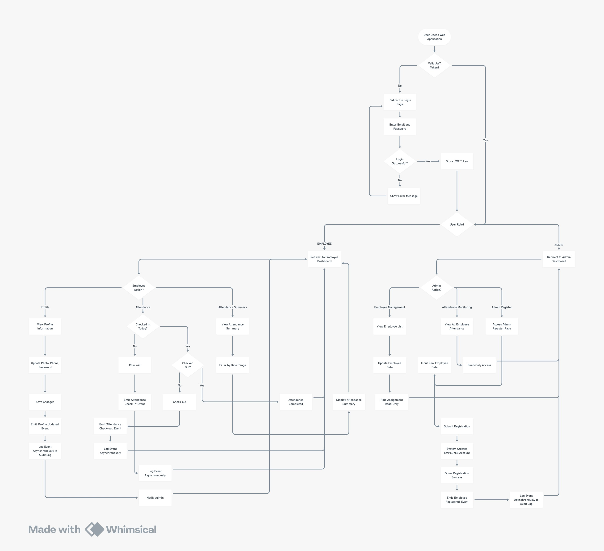

# Dexa Attendance System — Frontend (Dexa-FE)

Frontend application for Dexa Fullstack Technical Test.
This project is built with a strong focus on clarity, correctness, UX consistency, and realistic engineering decisions rather than over-engineering.

1. OVERVIEW

Dexa-FE is a role-based attendance management frontend that supports employee attendance tracking, employee profile management, admin employee management, and admin activity monitoring with near-realtime notifications.

The frontend communicates with a NestJS backend through REST APIs and follows a predictable and maintainable architecture.

2. TECH STACK

- React (Vite)
- TypeScript
- Redux Toolkit
- React Router DOM
- Axios
- Tailwind CSS
- react-toastify

3. CORE DESIGN PRINCIPLES

- Mobile-first and responsive UI
- Clean and minimal visual design
- Explicit data flow with no hidden logic
- No API calls directly inside page components
- Redux is used only for global or shared state
- Avoid unnecessary abstractions
- Readability and maintainability are prioritized

4. PROJECT STRUCTURE

The frontend project is structured as follows:

```
Dexa-FE
├── README.md
├── eslint.config.js
├── index.html
├── package-lock.json
├── package.json
├── postcss.config.js
├── public
│   ├── avatar.png
│   └── vite1.svg
├── src
│   ├── App.tsx
│   ├── components
│   │   ├── AdminNotifier.tsx
│   │   ├── Header.tsx
│   │   ├── MobileNavButton.tsx
│   │   └── NavButton.tsx
│   ├── index.css
│   ├── main.tsx
│   ├── pages
│   │   ├── AdminAttendance.tsx
│   │   ├── AdminAuditLogs.tsx
│   │   ├── AdminRegister.tsx
│   │   ├── AdminUserEdit.tsx
│   │   ├── AdminUsers.tsx
│   │   ├── Attendance.tsx
│   │   ├── Login.tsx
│   │   ├── Profile.tsx
│   │   ├── ProfileUpdatePhoto.tsx
│   │   ├── UpdatePassword.tsx
│   │   └── UpdatePhone.tsx
│   ├── routes
│   │   └── ProtectedRoute.tsx
│   ├── services
│   │   └── api.ts
│   ├── store
│   │   ├── hooks.ts
│   │   ├── index.ts
│   │   └── slices
│   │       ├── adminAttendance.slice.ts
│   │       ├── adminRegister.slice.ts
│   │       ├── adminUser.slice.ts
│   │       ├── attendance.slice.ts
│   │       ├── auditLog.slice.ts
│   │       ├── auth.slice.ts
│   │       └── user.slice.ts
│   └── utils
│       ├── auditLastSeen.ts
│       ├── groupAuditLogs.ts
│       ├── jwt.ts
│       └── pollingInterval.ts
├── tailwind.config.js
├── tsconfig.app.json
├── tsconfig.json
├── tsconfig.node.json
└── vite.config.ts
```

This structure separates concerns clearly between UI components, pages, routing, global state management, services, and shared utilities.

5. AUTHENTICATION AND AUTHORIZATION

Authentication is handled through POST /auth/login.  
JWT tokens are stored in localStorage and automatically attached to every request using an Axios interceptor.

Authorization is role-based with two roles: EMPLOYEE and ADMIN.  
Protected routes are enforced using a ProtectedRoute component.

After login:

- EMPLOYEE users are redirected to /attendance
- ADMIN users are redirected to /admin/register

6. GLOBAL STATE MANAGEMENT (REDUX)

Redux Toolkit is used only for shared or global state.

Redux slices include:

- auth.slice for authentication state (token, role, userId)
- attendance.slice for attendance data
- user.slice for user profile data
- auditLog.slice for admin audit log data

UI pages never call APIs directly. All API interactions are handled through Redux async thunks to ensure predictable data flow.

7. ATTENDANCE FEATURES

Employee features:

- View personal attendance records
- Filter attendance by date range (From – To)
- Reset filter
- Attendance history is read-only

Admin features:

- View attendance records for all employees
- Attendance list is read-only

8. PROFILE MANAGEMENT (EMPLOYEE)

The profile page displays name, email, role, phone number, and profile photo.  
Edit actions are shown inline with data, keeping information and actions aligned visually.

Profile update flows include:

- Update phone number
- Update password
- Update or remove profile photo

9. PHONE NUMBER RULES

Phone number input follows these rules:

- Numeric only
- Minimum length of 8 digits
- Maximum length of 15 digits
- Automatically formatted every 4 digits using a dash character

Example:  
08123456789 becomes 0812-3456-789

Formatting is handled in the frontend while the backend receives numeric-only values.

10. PROFILE PHOTO UPLOAD

Profile photo upload flow:

- Frontend uploads the image file
- Backend uploads the file to Cloudinary
- Backend stores the image URL in the database
- Frontend displays the updated photo

Rules:

- PNG images only
- File size validation enforced
- Default avatar shown if no photo exists
- Photo removal supported, including Cloudinary cleanup

11. ADMIN MANAGEMENT

Admin Users:

- View list of all employees
- Edit employee name and phone number
- Editing is performed on a dedicated page

Admin Register:

- Admin-only feature
- Register new employee
- Frontend validation includes email format and password rules
- Successful registration result is displayed inline

12. ADMIN NOTIFICATION SYSTEM (NEAR REALTIME)

Admins receive near-realtime notifications for important employee activities using polling and audit logs.  
This implementation intentionally avoids WebSocket or SSE to remain simple and reliable.

Supported events:

- ATTENDANCE_CHECK_IN
- ATTENDANCE_CHECK_OUT
- USER_PROFILE_UPDATED

13. DYNAMIC POLLING STRATEGY

Polling frequency is adjusted dynamically:

- 09:00 – 10:00: every 30 seconds
- 17:00 – 18:00: every 30 seconds
- Other times: every 1 hour

14. NOTIFICATION BEHAVIOR

- Notifications are admin-only
- Implemented using react-toastify with custom styling
- Attendance events are grouped into one notification
- Profile updates are grouped into a separate notification
- Notifications are clickable and navigate to the admin audit log page
- Last-seen state is stored in localStorage to prevent duplicate notifications

15. ADMIN AUDIT LOG VIEWER

The admin audit log viewer is available at /admin/audit-logs.
It displays employee name, action type, and timestamp in a read-only table sorted by newest first.

This completes the full flow from employee action to admin notification and audit log review.

16. UI AND UX CONSISTENCY

The UI follows consistent styling rules across all pages, including background color, card layout, typography hierarchy, and responsive behavior.

The header adapts between desktop and mobile views using a hamburger menu, with role-based navigation items and persistent logout access.

17. ERROR HANDLING

API errors are displayed clearly in alert components.  
Expired tokens trigger automatic logout.  
No silent failures are allowed.

18. HOW TO RUN

Install dependencies and start the development server using standard npm commands.  
The backend service must be running and accessible.

19. NOTES FOR REVIEWER

This frontend emphasizes clarity, correctness, and intentional engineering decisions.  
The admin notification system demonstrates event-driven thinking, performance-aware polling, and thoughtful UX design.

20. FLOW CHART DIAGRAM



21. FINAL NOTES

This frontend is designed to be easy to review, easy to reason about, and clear in its architectural decisions.
Thank you for reviewing this technical test.
